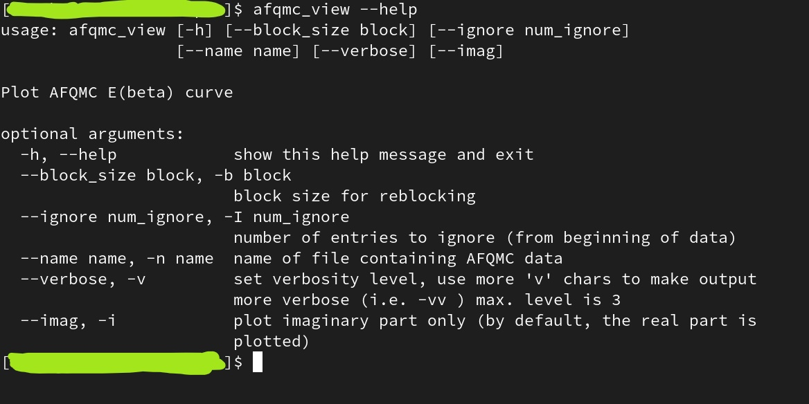
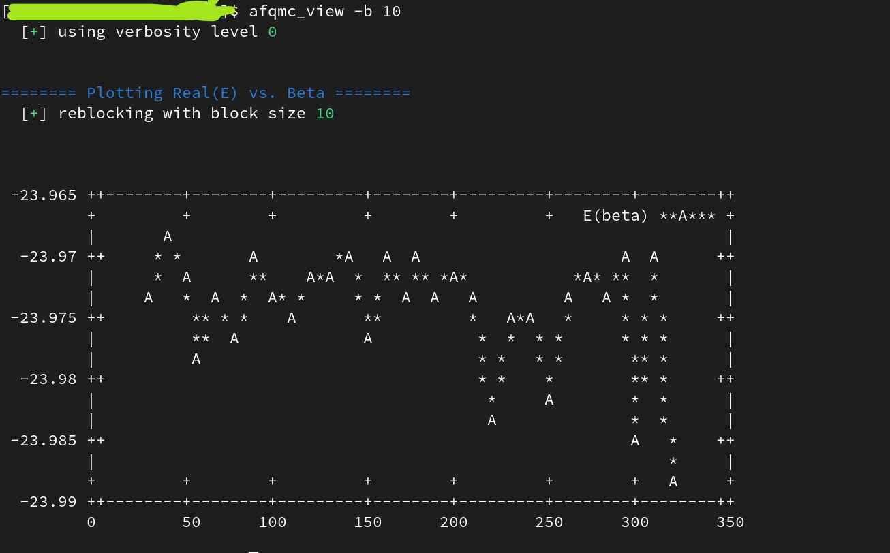

# AFQMC_ascii_plots

This repo is an example provided in relation to our list of [research tools](https://github.com/bbusemeyer/research_tools).
Here, we make simple ASCII plots for AFQMC based on gnuplot in 'dumb' terminal mode.
Currently, only energy versus total projection time curves for output in afqmclab's format are implemented; however,
a wider variety of plots/formats can be easily added by request.

This is also a good example of the 'argparse' python module which alows command line arguments to be easily parsed within python. 
It also automatically generates a 'help' option.



## Suggested Installation

The script can be easily installed in several ways. Here is my favorite way to install for Linux!:

  1. clone this repository in a directory of your choice ( lets say, ~/scripts/ascii_plots )

```bash
mkdir -p ~/scripts
cd ~/scripts/
git clone git@github.com:bkesk/AFQMC_ascii_plots.git ascii_plots
```

  2. make a soft link to the script within your ~/bin/ directory

```bash
cd ~/bin/
ln -s ~/scripts/ascii_plots/afqmc_view.py afqmc_view
```

  3. make it executable
```bash
chmod u+x afqmc_view
```

Now, you should be able to run the command using only
```bash
afqmc_view <options>
```

## example

Here is a minimal example of using this script.
You must have AFQMC results from afqmclab, first.
Then, run 

```bash
afqmc_view
```

from within the directory containing the results.




